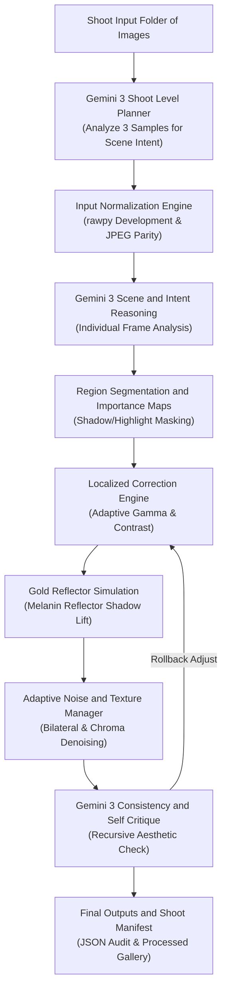

```mermaid
flowchart TD
    A["Shoot Input Folder of Images"]
    B["Gemini 3 Shoot Level Planner<br/>(Analyze 3 Samples for Scene Intent)"]
    C["Input Normalization Engine<br/>(rawpy Development & JPEG Parity)"]
    D["Gemini 3 Scene and Intent Reasoning<br/>(Individual Frame Analysis)"]
    E["Region Segmentation and Importance Maps<br/>(Shadow/Highlight Masking)"]
    F["Localized Correction Engine<br/>(Adaptive Gamma & Contrast)"]
    G["Gold Reflector Simulation<br/>(Melanin Reflector Shadow Lift)"]
    H["Adaptive Noise and Texture Manager<br/>(Bilateral & Chroma Denoising)"]
    I["Gemini 3 Consistency and Self Critique<br/>(Recursive Aesthetic Check)"]
    J["Final Outputs and Shoot Manifest<br/>(JSON Audit & Processed Gallery)"]

    A --> B
    B --> C
    C --> D
    D --> E
    E --> F
    F --> G
    G --> H
    H --> I
    I --> J
    I -- "Rollback Adjust" --> F
```